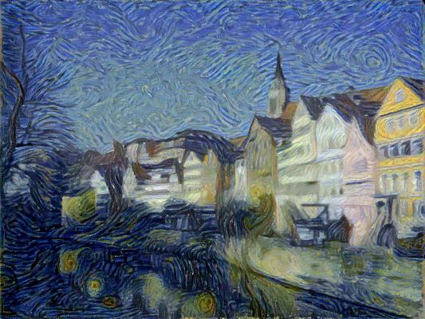
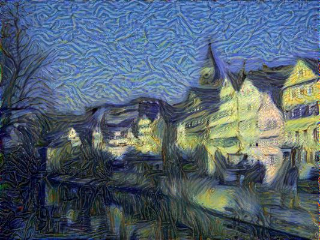
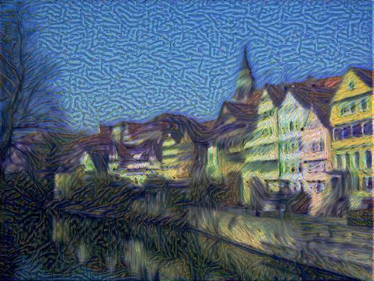
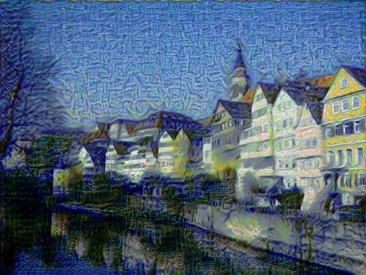
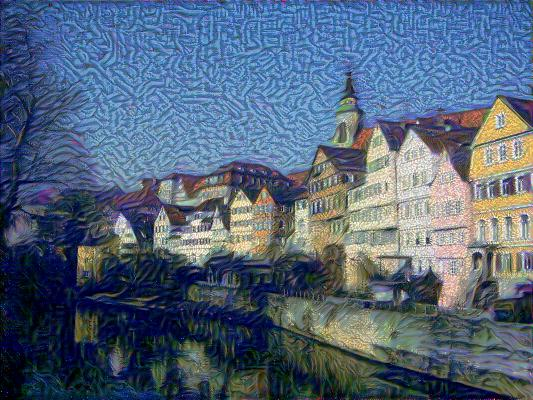

# image-style-transfer

    Images style transfer via many pretrained models by Gatys' method

----

ℹ Extending Leon A. Gatys' paper ["Image Style Transfer Using Convolutional Neural Network" (CVPR 2016)](https://www.cv-foundation.org/openaccess/content_cvpr_2016/papers/Gatys_Image_Style_Transfer_CVPR_2016_paper.pdf) to other pretrained models far beyond vgg19 ;)

### Experiments

> All tests are run on a single RTX 3060.

| content image | style image |
| :-: | :-: |
|  |  |

| model | transferred image | runtime | remark |
| :-: | :-: | :-: | :-: |
| vgg19         |                  |  39.086s | nice! |
| sd-vae-ft-mse |  | 213.099s | just ok |
| sdxl-vae      |            | 213.138s | loss very large |
| taesd         |                  |  35.035s | bad texture |
| taesdxl       |              |  34.599s | bad texture |

### Quickstart

- install PyTorch-GPU follow the [official guide](https://pytorch.org/get-started/locally/)
- `pip install -r requirements.txt`
- run the demo images: `python run_<model>.py`
- run your own images: `python run_<model>.py -C /path/to/content.jpg -S /path/to/style.jpg`

### references

- 图像风格迁移详解: [https://zhuanlan.zhihu.com/p/55948352](https://zhuanlan.zhihu.com/p/55948352)
- https://github.com/EliShayGH/deep-learning-style-transfer
- https://github.com/gsurma/style_transfer

----
by Armit  
2024/02/13 init repo  
2024/10/08 merge new repo  
